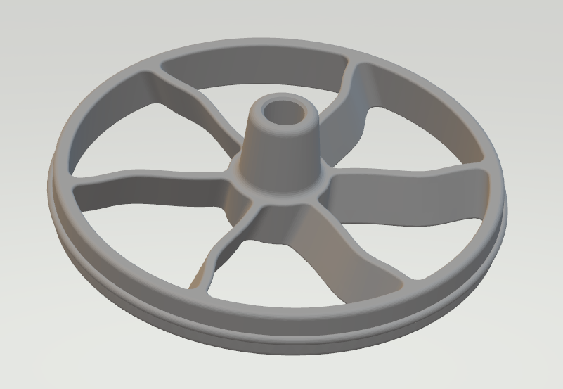

# Replacement Plunger for Pampered Chef Mixer and Dispenser

## Overview

This is a 3D printed replacement plunger designed for the Pampered Chef Mixer and Dispenser. The original plunger is known to fail after just a couple of years of use, and this model aims to provide a durable, cost-effective solution.

## Features

- **Compatibility:** Designed to fit perfectly with the Pampered Chef Mixer and Dispenser.
- **Ease of Use:** Simple installation; no tools required beyond basic assembly.

## Installation

1. **Prepare the Hole:** Drill or ream the top of the existing hole to 5/16" (which is just smaller than an 8mm shaft diameter).
2. **Insert the Rod:** Carefully insert the rod and then thread it into the plastic threads. 
   - **Optionally:** For enhanced durability, you can use a threaded insert if desired.

3. **Clean the Area:** Ensure the mixer is clean and free of any residue where the plunger sits.
4. **Remove Old Plunger:** If any part of the old plunger remains, carefully remove it.
5. **Insert New Plunger:** Place the 3D printed plunger into the dispenser, ensuring it moves freely but snugly.

## Usage

- This part is intended for personal, non-commercial use. 
- This model is shared under the spirit of **fair use**, aiming to assist users in maintaining their kitchen tools without the need for purchasing expensive replacements.

## License

- **License:** CC BY-NC 4.0 - Creative Commons Attribution-NonCommercial 4.0 International
- **Usage:** While this model is free for non-commercial use, please do not use it for commercial purposes without permission.

## Support

If you encounter any issues or have suggestions for improvements:

- Open an issue on this GitHub repository.
- Contribute by submitting pull requests with your modifications or enhancements.

## Acknowledgements

- Thanks to the community for feedback and contributions.
- Acknowledgment to Pampered Chef for the original design inspiration.

## Disclaimer

This is not an official product of Pampered Chef, nor is it affiliated with them in any way. Use at your own risk. This part is shared to extend the life of your existing product, but no warranty or guarantee is implied or provided.

## Files

- `mixerAndDispenserPlunger.stl` - The 3D model file ready for printing.
- `plunger.PNG` - Image of the replacement plunger.

## Contact

For questions or collaboration, you can reach out via [your email or preferred contact method].

---

Happy printing, and enjoy your rejuvenated mixer and dispenser!